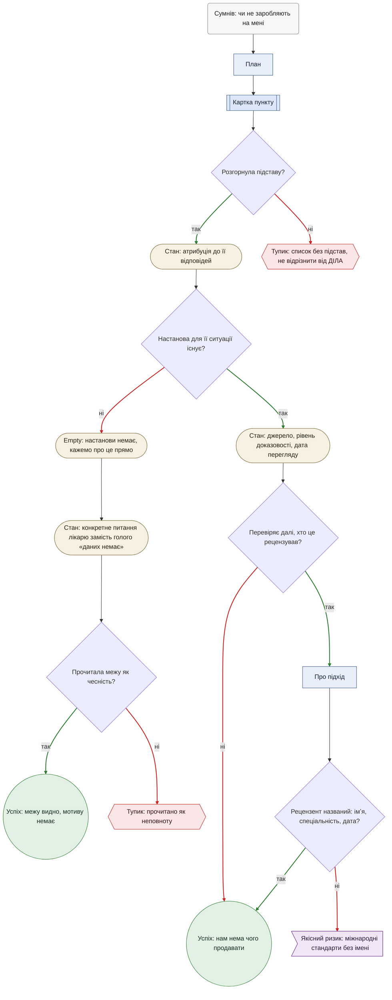
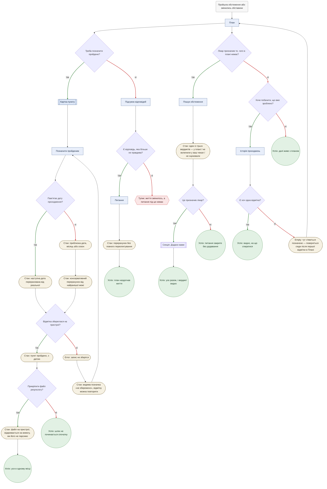
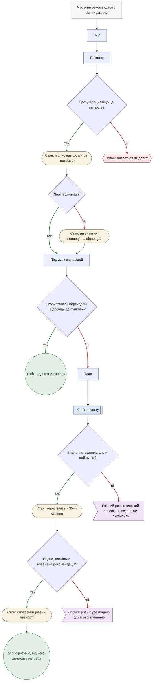

# User flows

Шляхи людини крізь екрани з [`sitemap.md`](sitemap.md). Нових екранів тут немає —
flows перевіряють ті, що вже спроєктовані, і показують, де людина застрягає.

Створено 16.09.2026, оновлено 26.09.2026.

## Як читати

| Форма | Що це |
|---|---|
| `("текст")` | Тригер — момент у житті, з якого починається робота |
| `["Екран"]` | Екран із [дерева sitemap](sitemap.md#дерево) |
| `[["Секція"]]` | Секція або картка **всередині** екрана, названа в sitemap |
| `(["Стан"])` | Стан екрана: empty, loading, error та інші — **не екран** |
| `{"Питання?"}` | Точка рішення |
| `(("Успіх"))` | Робота закрилась |
| `{{"Тупик"}}` | Людина застрягла |
| `>"Якісний ризик"]` | Дефект нашого контенту — немає джерела, однакова впевненість там, де мала бути градація. Не місце, де застрягає людина, а місце, де застрягли ми як автори контенту |

**Колір гілки кодує відповідь, а не її якість.** Зелена — «так», червона — «ні»,
і це не означає «добре» й «погано»: «так, є тривожний симптом» — зелена гілка й погана
новина, а «ні, не пішла перевіряти джерело» — червона гілка й цілком нормальний результат.
Кілька червоних гілок навмисно ведуть в успіх.

**Четверта форма — не тупик.** `>"Якісний ризик"]` відрізняється від `{{"Тупик"}}`
навмисно: тупик — це людина застрягла в інтерфейсі, якісний ризик — це наша
аргументація неповна (немає джерела, немає градації впевненості). Перший лагодить
дизайн взаємодії, другий — автор контенту й лікар-рецензент. Нижче в цю форму
переведено три вузли, які раніше помилково рахувались як тупики: R1 «плоский
список», R1 «усе однаково впевнено», E1 «стандарти без імені».

**Чотири flow, а не десять.** [MAIN](sitemap.md#дерево) — повністю; далі
[E1](#e1--перестати-відчувати-що-на-мені-заробляють) і
[R4a](#r4a--не-починати-шлях-спочатку), бо разом із MAIN вони складають
[ядро MVP](research/jtbd.md#висновок-ядро-mvp), і
[R1](#r1--зрозуміти-логіку-а-не-отримати-відповідь) — наступна в черзі й визначальна
для [П2](research/personas.md#п2--системна-але-наосліп) та
[П3](research/personas.md#п3--перше-коло). E1 за класифікацією `jtbd.md` —
emotional job, не related; він тут тому, що це
[найзахищеніша позиція продукту](research/jtbd.md#2--e1--перестати-відчувати-що-на-мені-заробляють),
а не тому, що підходить за рубрикою.

---

## MAIN · Розуміти, що з призначеного справді про мене

> Коли мені призначили більше, ніж я вважаю потрібним, і я не можу відрізнити необхідне
> від зайвого, я хочу розуміти, що з цього справді стосується мене, щоб піти спокійною
> і за те, що зробила, і за те, чого не робила.
>
> — [`jtbd.md` → Main job](research/jtbd.md#main-job)

```mermaid
flowchart TD
    start("Вийшла від лікаря зі списком призначень")
    start --> entry["Вхід"]
    entry --> d1{"Видно джерела і те, що нам нема чого продавати?"}
    d1 -->|ні| dead1{{"Тупик: пішла, не почавши"}}
    d1 -->|так| quiz["Питання"]
    quiz --> sSave(["Стан: автозбереження прогресу"])
    sSave --> d3{"Дійшла до кінця опитувальника?"}
    d3 -->|так| summary["Підсумок відповідей"]
    d3 -->|ні| dead2{{"Тупик: кинула на середині, прогрес є, плану немає"}}
    dead2 -->|повернулась сама| sResume(["Стан: Відновлення незавершеного опитувальника"])
    sResume --> quiz
    summary --> sLoad(["Loading: обрахунок плану на пристрої"])
    sLoad --> d5{"Локальні дані на місці?"}
    d5 -->|так| plan["План"]
    d5 -->|ні| sErr(["Error: локальні дані втрачено"])
    sErr --> dead3{{"Тупик: заповнювати заново"}}
    plan --> d2{"Серед відповідей є тривожний симптом?"}
    d2 -->|так| flag[["Алерт: зверніться до лікаря зараз"]]
    d2 -->|ні| d6{"Є ризик-орієнтовані пункти?"}
    flag --> d4{"Звернулася до лікаря зараз?"}
    d4 -->|так| okDoc(("Успіх межі безпеки"))
    d4 -->|ні| sGuard(["Стан: алерт прогорнуто, спрацював запобіжник"])
    sGuard --> d6
    d6 -->|так| sect[["Секція: Розглянули і не включили"]]
    d6 -->|ні| sShort(["Стан: короткий план, це не empty"])
    sShort --> sect
    sect --> d7{"Знайшла те, що їй призначили?"}
    d7 -->|так| sBasis(["Стан: підстава невключення видима одразу"])
    d7 -->|ні| search["Пошук обстеження"]
    search --> d8{"Обстеження є в нашому довіднику?"}
    d8 -->|так| sVerdict(["Стан: розглянули і не включили у ваш чекап, з підставою і джерелом"])
    d8 -->|ні| sNoEval(["Стан: не оцінювали, це не означає ні «треба», ні «не треба»"])
    sVerdict --> d9{"Це призначив лікар?"}
    sNoEval --> d9
    d9 -->|так| sAdd(["Стан: додати до списку, щоб усе було в одному місці"])
    d9 -->|ні| okMain(("Успіх: спокій за обидві половини"))
    sAdd --> okTogether(("Успіх: облік ведемо, поради не даємо"))
    sBasis --> okMain

    classDef trig fill:#f7f7f7,stroke:#888,color:#222
    classDef screen fill:#e8eefa,stroke:#3b5b8c,color:#12233d
    classDef section fill:#dde7f7,stroke:#3b5b8c,color:#12233d
    classDef state fill:#f6f1e3,stroke:#8a7a4e,color:#2a2415
    classDef ok fill:#e2f1e4,stroke:#2e7d32,color:#12301a
    classDef dead fill:#fae6e6,stroke:#c62828,color:#3d1414
    class start trig
    class entry,quiz,summary,plan,search screen
    class sect,flag section
    class sSave,sGuard,sLoad,sErr,sShort,sBasis,sResume,sVerdict,sNoEval,sAdd state
    class okDoc,okMain,okTogether ok
    class dead1,dead2,dead3 dead
    linkStyle 3,6,12,16,19,22,26,29,33 stroke:#2e7d32,stroke-width:2px
    linkStyle 2,7,13,17,20,23,27,30,34 stroke:#c62828,stroke-width:2px
```

**Рішення**

1. **Профіль вселяє довіру?** На Вході — до першої відповіді. Це
   [відкрите питання №3 дослідження](research/research.md#три-відкриті-питання-до-pm):
   ДІЛА вже каже «нічого зайвого» нашими словами, тож різницю треба довести за п'ять секунд.
2. **Дійшла до кінця?** Тут живе [північна зірка](CLAUDE.md#північна-зірка). Гілка «ні»
   більше не глухий кут: автозбереження дозволяє повернутись і продовжити з того самого
   місця (стан «Відновлення незавершеного опитувальника»).
3. **Локальні дані на місці?** Ціна архітектурного рішення «тільки на пристрої».
4. **Серед відповідей є тривожний симптом?** **Змінено 23.09.2026 рішенням власниці.**
   Раніше це був окремий екран, що перехоплював візард у будь-якій точці — і в списку
   рішень він стояв другим. Тепер перевірка стоїть **після** опитувальника: жінку не
   зупиняють посеред питань, вона доходить до кінця, а попередження чекає її
   [пріоритетним алертом над планом](sitemap.md#дерево) — рівно так, як
   [бриф і формулював із самого початку](CLAUDE.md#блоки-опитувальника). Безпекова межа
   не ослабла в силі, але змінила момент: ціна — жінка, яка кинула опитувальник після
   питання про симптоми й не повернулась, алерта не побачить.
5. **Звернулася до лікаря зараз?** Єдина точка, де правильний результат — **вийти
   з продукту**.
6. **Є ризик-орієнтовані пункти?** Гілка «ні» — це не помилка, а
   [П3](research/personas.md#п3--перше-коло) у типовому випадку.
7. **Знайшла те, що їй призначили?** Гілка «ні» більше не тупик: веде в
   [Пошук обстеження](sitemap.md#дерево).
8. **Обстеження є в нашому довіднику?** Тут розходяться два різні стани, і змішувати їх
   заборонено: «розглянули і не включили **у ваш чекап**» — з підставою й джерелом; проти
   «не оцінювали» — бо сказати «розглянули» про те, чого ми не розглядали, означало б
   [вигадати вердикт](CLAUDE.md#правила-роботи-з-медичним-контентом).
9. **Це призначив лікар?** Ми не заперечуємо лікарю — ми пропонуємо **записати** призначення
   до себе. «Додайте до списку», ніколи «звісно робіть»: облік, а не медична порада.

**Стани** — автозбереження прогресу · алерт прогорнуто (подія
[запобіжника](CLAUDE.md#запобіжники)) · loading обрахунку · error втрачених даних ·
короткий план · підстава видима без другого тапу · відновлення незавершеного
опитувальника (Т2).

**Кінці**

- ✅ **Успіх MAIN** — знайшла призначене серед невключених і побачила підставу. Три тапи
  з першого візиту, [один — із повернення](sitemap.md#глибина-до-main-job).
- ✅ **Успіх межі безпеки** — пішла до лікаря замість плану. З 23.09.2026 цей кінець
  досяжний лише з Плану: алерт стоїть над ним, а не посеред візарда.
- ⛔ **Пішла, не почавши** — не повірила Входу. **Навмисний кінець, не пропуск.**
  Уся робота Входу — зняти недовіру за п'ять секунд (рішення 1 вище); якщо це не
  спрацювало, у продукту немає іншого важеля саме в цій точці. «Про підхід»
  лишається доступним з глобальної навігації за 1 тап у будь-який момент
  ([`sitemap.md` → Г3](sitemap.md#що-це-дерево-вирішує-проти-чого)), але це її
  власна ініціатива, а не крок, який цей flow примушує зробити, — довіру не
  можна прописати сценарієм.
- ⛔→**не термінал** **Кинула на середині** — прогрес збережено, але цінності вона не
  отримала. Раніше це був глухий кут; тепер `dead2` веде в стан «Відновлення
  незавершеного опитувальника» й повертає в Питання з того самого місця. Тупик
  описує момент виходу із сесії, а не остаточну втрату: якщо вона повернеться,
  автозбереження підхоплює її звідти, де вона зупинилась. **Але повернення —
  цілком її власна ініціатива:** [активних нагадувань у MVP немає](CLAUDE.md#ключові-рішення),
  і продукт не має чим покликати її назад. Тому ребро підписане «повернулась сама»:
  воно описує не вихід усередині сесії, а нову сесію, якої може й не бути.
- ⛔ **Заповнювати заново** — дані пристрою зникли; наслідок приватності, а не баг.
- ✅ **Облік ведемо, поради не даємо** — призначене лікарем лягло у власний шар, наш
  вердикт стосується тільки чекапу.
- **Головний тупик MAIN закритий (18.09.2026).** Раніше він читався так: секція
  показує невключене **з нашої логіки**, а вона прийшла з конкретним призначенням від
  лікаря — і продукт мовчав рівно там, де мав відповісти. Тепер гілка «ні» веде в
  [Пошук обстеження](sitemap.md#дерево): або наш вердикт із підставою, або пряме
  «не оцінювали». Молчання зникло; порожнім місцем його більше не замінюємо.

---

## E1 · Перестати відчувати, що на мені заробляють

> Коли мені призначають те, чого я не розумію, я хочу відчувати, що мене не використовують,
> щоб кожен візит не коштував мені ще й підозри.
>
> — [`jtbd.md` → E1](research/jtbd.md#e1--перестати-відчувати-що-на-мені-заробляють)

**Рішення**

1. **Розгорнула підставу?** Гілка «ні» — це і є ДІЛА: обіцянка персоналізації без доказу.
2. **Настанова для її ситуації існує?** Гілка «ні» веде не в помилку, а в
   [правило медичного контенту](CLAUDE.md#правила-роботи-з-медичним-контентом):
   «даних недостатньо, обговоріть із лікарем».
3. **Що з цим робити?** (Т8) Новий крок після empty-стану: сама констатація
   «настанови немає» читається як недбалість, якщо не сказати, що робити далі.
   `sAction` перетворює межу на дію — конкретне питання для прийому в лікаря,
   а не голу відсутність даних.
4. **Прочитала межу як чесність?** Ризик [П2](research/personas.md#п2--системна-але-наосліп):
   явна межа легко читається як неповнота — навіть після конкретної дії на кроці 3.
5. **Перевіряє далі?** Червона гілка веде в успіх: не перевіряти — нормально.
6. **Рецензент названий?** Тут перевіряється
   [S2](research/jtbd.md#s2--спиратися-на-когось-кому-довіряю-особисто) — довіра
   позичається в названих людей, не в брендів.

**Стани** — атрибуція до відповідей · джерело з грейдом і датою під розкриттям ·
**empty «настанови немає»**, який у цьому продукті є вмістом, а не порожнечею ·
конкретне питання лікарю замість голої констатації (Т8).

**Кінці**

- ✅ **Нам нема чого продавати** — видно джерело, видно ім'я рецензента.
- ✅ **Межу видно, мотиву немає** — навіть там, де настанови немає, видно, що ми не вигадали.
- ⛔ **Не відрізнити від ДІЛА** — підставу не розгорнули. Це рівно те, що міряє
  [підтримувальна метрика №1](CLAUDE.md#підтримувальні). **Навмисний кінець:**
  розгортання — її власна дія, продукт не примушує до неї (без темних патернів);
  саме тому продукт покладається на метрику, а не на ще один примусовий крок flow.
- ⛔ **Прочитано як неповноту** — межа продукту не переконала, навіть після
  конкретного «що спитати лікаря» на кроці 3. Якщо чесність про межу все одно
  читається як недогляд, далі в цій сесії продукту нема чим відповісти —
  залишається сигнал для рецензента переглянути формулювання, а не ще один UI-крок.
- ⚠ **Якісний ризик: міжнародні стандарти без імені** — сигнал довіри не
  спрацював, бо контенту бракує імені рецензента. За Т9 це не тупик: людина тут
  не застрягає в інтерфейсі, застрягли ми — лагодить рецензент, дописавши ім'я
  в «Про підхід», а не дизайнер взаємодії. `[?]` [Не перевірялось жодного
  разу](research/personas.md#тригери-довіри).

---

## R4a · Не починати шлях спочатку

> Коли я знову дійшла до лікаря, я хочу спиратися на те, що вже зробила, щоб не починати
> шлях спочатку.
>
> — [`jtbd.md` → R4a](research/jtbd.md#r4a--не-починати-шлях-спочатку)

**Рішення**

1. **Відмітка чи зміна відповіді?** Дві різні гілки одного job'а: «я це зробила» і
   «я тепер інша». Перша йде через картку, друга — через Підсумок відповідей.
2. **Пам'ятає точну дату?** Гілка «ні» більше не тупик: вона веде в **приблизну
   дату** (місяць або сезон) з консервативним перерахунком від найранішої межі
   діапазону — «весна» рахується як 1 березня, щоб не відсунути скринінг далі,
   ніж безпечно. Це медична логіка, а не UX: [потребує звірки з
   рецензентом](sitemap.md#5--відмітка-про-проходження).
3. **Збереглася на пристрої?** Єдине сховище — локальне.
4. **Є відповідь, яка більше не правдива?** Опитувальник не має питання під кожну зміну
   життя; частина змін просто не має куди потрапити.
5. **Хоче побачити історію?** Екран `[?]` — залежить від
   [питання №3 інвентаризації](sitemap.md#відкриті-питання).
6. **Є хоч одна відмітка?** Перше повернення завжди дає empty.
7. **Прикріпити файл результату?** Гілка «так» — це половина
   [R5](research/jtbd.md#r5--зрозуміти-що-зі-мною-відбувається-за-цифрами), яку продукт
   тепер виконує: «немає одного такого місця, де я все зберігаю» (Р2). Файл лежить
   і відкривається на пристрої; **парсера вмісту немає**, тому друга половина роботи
   («що ці цифри означають») не закривається й не закриється.
8. **Лікар призначив те, чого в плані немає?** Гілка «так» веде **не одразу в «Додано вами»,
   а через [Пошук обстеження](sitemap.md#дерево)** — і це свідомі ворота, а не лишній крок.
   Додати власний пункт можна тільки після того, як вона побачила один із трьох вердиктів.
9. **Це призначив лікар?** Якщо так — пункт лягає в «Додано вами» з уже побаченим вердиктом.
   Якщо ні — питання закрите й додавати нічого не треба: вона отримала відповідь, а не запис. (Т7) Цей empty більше не
   глухий кут: він каже, що саме тут з'явиться після першої відмітки, і веде назад у План —
   туди, де ту відмітку й ставлять.

**Стани** — файл результату на пристрої · один із трьох вердиктів пошуку · приблизна дата ·
консервативний перерахунок від найранішої межі ·
видима позначка «не збережено» · перерахунок наступної дати · пункт «пройдено»
з датою · перерахунок після
правки відповіді · error незбереженого запису · **empty порожньої історії, що пояснює,
що з'явиться, і веде назад у План**.

**Кінці**

- ✅ **Шлях не починається спочатку** · ✅ **План наздогнав життя** · ✅ **Видно, на що
  спиратися** · ✅ **Далі живе з планом** — R4a закривається чотирма різними шляхами,
  і це нормально: робота дрібна й часта.
- **Без дати — більше не тупик (Т5).** Сутність вимагала точної дати, а жінка
  пам'ятає «десь навесні». Тепер приблизна дата є повноцінним значенням поля,
  а округлення ведеться в безпечний бік.
- **Відмітка зникла — більше не тихий збій (Т6).** Раніше план показував старе
  й виглядав справним: найгірший вид помилки, бо людина не знає, що застрягла.
  Тепер помилка запису дає видиму позначку «не збережено» й повертає до спроби.
- ✅ **Усе в одному місці** — результат прикріплено до пройденого обстеження.
- ✅ **Усе разом, без чужого вердикту** — власний пункт стоїть поруч із нашими, і видно,
  що він її.
- ✅ **Питання закрите без додавання** — вона шукала не щоб записати, а щоб зрозуміти;
  вердикт отримала, запис не потрібен.
- **Тупика «межу прочитано як недоробку» тут більше немає (18.09.2026).** Раніше власний
  пункт додавався напряму з Плану, і продукт мовчав: молчання читалось як схвалення.
  Тепер [Пошук](sitemap.md#дерево) — **обов'язкові ворота**: додати можна лише після
  побаченого вердикту. Залишковий ризик перемістився туди, де він і має бути — у стан
  «не оцінювали» в [MAIN](#main--розуміти-що-з-призначеного-справді-про-мене), де межа
  проговорена словами.
- ⛔ **Життя змінилось, а питання під це немає.** **Навмисний кінець, не пропуск.**
  Опитувальник покриває сценарії, під які написані питання й правила; зміну життя поза
  цим набором продукт зараз не вміє вловити — вигадувати відповідь без правила, яке її
  споживає, суперечило б [«нічого не вигадувати»](CLAUDE.md#правила-роботи-з-медичним-контентом).
  Тихо повернути її в План, ніби нічого не змінилось, було б нечесніше, ніж явний тупик.
- **Empty історії більше не тупик (Т7).** Раніше `dead4` завершував гілку; тепер `sEmpty`
  пояснює, що тут з'явиться, і повертає в План — ту саму точку, звідки ставлять першу
  відмітку. Це замикає R4a в контур, а не залишає його відкритим кінцем.

---

## R1 · Зрозуміти логіку, а не отримати відповідь

> Коли я чую різні рекомендації з різних джерел, я хочу розуміти, від чого залежить
> потреба саме в моєму випадку, щоб перестати вирішувати навмання.
>
> — [`jtbd.md` → R1](research/jtbd.md#r1--зрозуміти-логіку-а-не-отримати-відповідь)

**Рішення**

1. **Зрозуміло, навіщо питають?** Підпис під питанням — [механізм
   Aura](research/research.md#три-механізми-які-варто-взяти). Для
   [П3](research/personas.md#п3--перше-коло), у якої досвід із системою почався
   з приниження, гілка «ні» — це вихід, а не незручність.
2. **Знає відповідь?** «Не знаю» — значення поля, а не глухий кут.
3. **Скористалась переходом «відповідь → пункти»?** Раніше гілки «так» не існувало:
   навігація вела від пункту до відповідей, але не назад, і R1 стояв рівно на цьому.
   [Відкрите питання навігації №2](sitemap.md#відкриті-питання) закрите (Т10):
   перехід є, і гілка «ні» тепер означає лише те, що людина ним не скористалась.
4. **Видно, які відповіді дали цей пункт?** Атрибуція — [механізм Credit
   Karma](research/research.md#три-механізми-в-mvp), єдине, що робить 15–25 питань
   вартими зусиль. Гілка «ні» (Т9) — не тупик взаємодії, а якісний ризик: контенту
   бракує атрибуції, і лагодить це автор контенту, не UI.
5. **Видно силу рекомендації?** Словесні рівні певності проти плоского списку.
   Гілка «ні» (Т9) — той самий клас: контент не градує впевненість.

**Стани** — підпис «навіщо питаємо» · «не знаю» як відповідь · атрибуція · словесний
рівень певності.

**Кінці**

- ✅ **Розуміє, від чого залежить потреба** — через атрибуцію й рівень певності.
- ✅ **Видно залежність від конкретної відповіді** — перехід від відповіді до
  пунктів, які вона породила, ухвалено в [навігації](sitemap.md#відкриті-питання)
  (Т10). Це зворотний бік атрибуції, що вже є в Підставі.
- ⛔ **Читається як допит** — найдорожчий тупик для П3. **Навмисний кінець, уже
  покритий полем продукту.** Підпис «навіщо ми це питаємо» — саме те поле сутності
  [«Питання»](sitemap.md#7--питання), яке існує для запобігання цій гілці; якщо
  попри нього допит все одно відчувається, у продукту зараз немає другого
  запобіжника саме тут — це вже правка формулювання конкретного питання, а не
  нового кроку flow.
- ⚠ **Якісний ризик: плоский список** — 20 питань не окупились; тут же гине
  [північна зірка](CLAUDE.md#північна-зірка) на другому візиті. За Т9 це не місце,
  де людина застрягає, а місце, де ми не показали атрибуцію, яку зобов'язані
  показувати — лагодить автор контенту.
- ⚠ **Якісний ризик: усе подано однаково впевнено** — К3 = 1 за
  [бенчмарком](research/research.md#вісім-критеріїв-шкала-15). Так само дефект
  градації контенту, не інтерфейсу.

---

## Що flows знайшли

П'ять речей, яких не було видно на статичному дереві, — чотири про продукт і одна
методологічна:

1. ~~**Головний тупик MAIN — не в плані, а в тому, чого в плані немає.**~~ **Закрито
   18.09.2026** [Пошуком обстеження](sitemap.md#дерево) з трьома станами відповіді.
   Молчання лишилось тільки там, де ми справді не оцінювали, — і навіть там воно
   проговорене словами, а не порожнім місцем. Ціна рішення: підстава потрібна на кожну
   позицію довідника, з рецензією.
2. ~~**Відмітка про проходження ламається на даті.**~~ **Закрито:** приблизна дата —
   місяць або сезон — із консервативним перерахунком від найранішої межі
   ([sitemap](sitemap.md#5--відмітка-про-проходження), [макет](wireframes/mark-done.html)).
3. **R5 закрилась наполовину.** Вкладення до відмітки й власний пункт виконують
   «безперервність» — усе в одному місці, — не торкаючись «розшифровки». Це перестало
   бути порожнім рядком матриці: див. [`sitemap.md` → Трасування](sitemap.md#матриця).
4. ~~**R1 упирається у відсутній зворотний зв'язок** «відповідь → пункт плану».~~
   **Закрито:** «Дало у плані: …» біля кожної відповіді в [Підсумку](wireframes/summary.html).
5. **Три з п'ятнадцяти «тупиків» насправді не про застряглу людину, а про наш
   контент.** R1 «плоский список», R1 «усе однаково впевнено» й E1 «стандарти без
   імені» — місця, де застрягли ми як автори контенту (немає атрибуції, немає
   градації впевненості, немає імені рецензента), а не де застрягає людина в
   інтерфейсі. Перевід у форму «Якісний ризик» (Т9) звужує підрахунок реальних
   тупиків дизайну взаємодії до дванадцяти. Ще один — R4a «порожня історія без
   пояснення» — виявився не тупиком, а недописаним empty-станом (Т7): дописаний,
   він веде назад у План. Разом із доробленим виходом з MAIN «кинула на середині»
   (Т2, тепер веде через відновлення назад у Питання) у чотирьох діаграмах
   лишається **одинадцять** вузлів, де людина справді не має продовження.

Перші чотири додані в [`sitemap.md`](sitemap.md#уточнення-після-flows); п'ята —
методологічна знахідка самого flows.md, зафіксована в нотації вище.

**Дві глибокі дії свідомо лишаються поза діаграмами (24.09.2026).** Вайрфрейми
[«Експорт / імпорт копії»](wireframes/restore.html) і [«Почати заново, видалити
дані»](wireframes/delete-data.html) намальовані за [sitemap → Глибокі
дії](sitemap.md#глибокі-дії), але маршруту в жодному з чотирьох flow не мають — і це
не пропуск. Обидві не є кроком жодної роботи: копія — [контракт
помилки](sitemap.md#без-jobа--кандидати-не-зявлятися), видалення — залишок
«налаштувань». Їхнє місце в діаграмах з'явилося б тільки тоді, коли ми почнемо
малювати flow відновлення після втрати даних, а такої роботи в
[jtbd.md](research/jtbd.md) немає: [про втрату даних не питали
взагалі](research/jtbd.md#функції-кандидати-на-виліт).

**Окремо, 23.09.2026 — і це вже не знахідка, а рішення власниці.** Тривожний симптом
перестав бути екраном: діаграма MAIN більше не має вузла, що перехоплює візард. Замість
нього перевірка стоїть **після** обрахунку плану, а попередження — алерт над планом.
Діаграма від цього стала коротшою на один екран і чеснішою в одному місці: шлях до
[північної зірки](CLAUDE.md#північна-зірка) більше не має розгалуження, здатного вивести
жінку з опитувальника до того, як вона його закінчила.
